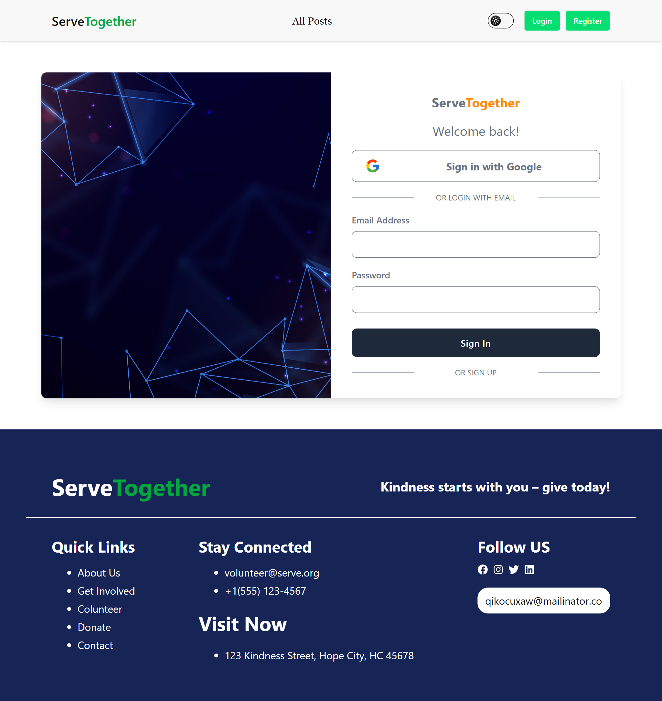

ServeTogether
ServeTogether is a community-driven web platform where users can post volunteering opportunities and request to become volunteers. Built using the MERN stack, it encourages civic engagement by making it easy to connect people who want to help with those who need it.

🌐 Live Demo
Frontend: https://serve-together-auth.web.app/

Backend API: https://servetogether-server.vercel.app/

## Test Account Credentials

You can use the following dummy account to log in and explore the app:

- Email: testuser@gmail.com
- Password: Test1234

## 🚀 Purpose

ServeTogether is a platform that connects organizations offering volunteer opportunities with individuals who want to give back to their communities. It simplifies the process of posting, discovering, and applying for volunteer work.

## 💡 Problem It Solves

Many people want to volunteer but don’t know where to start. ServeTogether solves this by providing a centralized platform for posting and finding volunteer opportunities, making community service more accessible.

> 🔔 **Note:** ServeTogether uses a **single user type**.  
> Users can both **post opportunities** and **request to volunteer** —  
> no need for multiple accounts or roles.

🚀 Features
✅ Post volunteering opportunities

✅ Request to volunteer

🔐 JWT-based authentication & protected routes

📅 Choose availability with datepicker

📊 Animated statistics and counters

📱 Fully responsive layout

🌗 Theme-aware UI with Tailwind CSS

🔔 Toast & alert feedback for better UX

🎞️ Swiper carousel and animated scroll reveals

🛠 Tech Stack
Frontend:
React

React Router

Axios

Tailwind CSS

Firebase (Authentication & Hosting)

Backend:
Express.js

MongoDB

JWT (Authentication)

UI/UX Libraries:
SweetAlert2

React Hot Toast

React Datepicker

React Awesome Reveal

React Icons

React CountUp

React Intersection Observer

Swiper

## 🖼️ Screenshots

